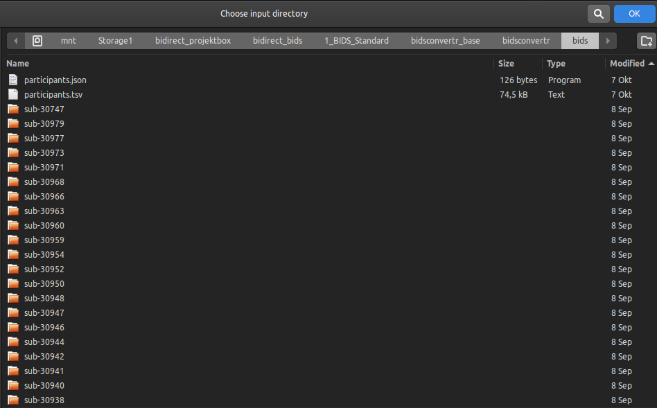
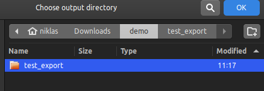
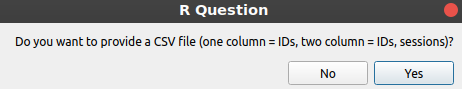
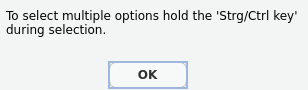
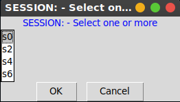
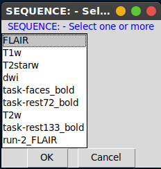
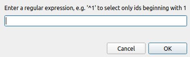
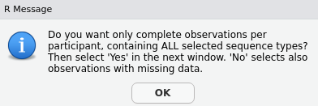
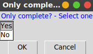
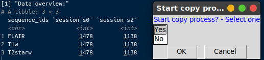

BIDSexportR
================

<!-- README.md is generated from README.Rmd. Please edit that file -->

# bidsexportr

<!-- badges: start -->
<!-- badges: end -->

The goal of bidsexportr is to the selection and export of relevant BIDS
data.

Features:

Basic: - selection of input folder (BIDS) - selection of output folder -
selection of sequences - selection of session

Advanced:

- selection of subjects with a regular expression (e.g. for filtering
  out specific cohorts)
- selection of only complete protocols
  - only all selected sequences per timepoint allowed
- selection of subjects with a csv file
  - subjects
  - subjects & session

## Installation

Install R and RStudio first. On Windows install RTools.

You can install the development version of bidsexportr from
[GitHub](https://github.com/) with the “devtools” package:

``` r
install.packages("devtools")
devtools::install_github("wulms/bidsexportr")
```

# Example workflow

## Start the tool

This is the function to start the workflow:

``` r
# load package
library(bidsexportr)
# start export function
start_export()
```

## Setting up the paths

A folder selection windows opens: Select the input folder that contains
the BIDS dataset. It is easy to recognize by all “sub-” prefix folders
and a “participants.tsv” file.



A folder selection windows opens: Create a folder for export and select
it. All selected files will be



OPTIONAL: You are able to provide an optional CSV file with headers
(e.g. subjectid, sessionid) with one of these two structures:

- subject-IDs
- subject-IDs (1st column) and session-IDs (2nd column)

| subjectid |
|-----------|
| 30750     |
| 10353     |
| 20226     |
| 15876     |
| 20223     |

Example 1: CSV with only subjectids

| subjectid | sessionid |
|-----------|-----------|
| 30750     | s0        |
| 30232     | s0        |
| 30750     | s2        |
| 30232     | s4        |
| 30232     | s6        |

Example 2: CSV with subject-IDs and session-IDs



A messagebox appears to inform the user about the selection of multiple
boxes inside the following windows by holding the Strg (GER) or Ctrl/Cmd
(ENG) key.



You are now able to select the identified sessions from the dataset.



You are now able to select the identified sequences from the dataset.



OPTIONAL: You can use a regular expression to select a specific group of
subject-IDs. E.g. each subject-ID starting with a “1”. You can also
filter for strings (e.g. “control”, “intervention”). Every match will be
kept.



You are informed about the “complete observation” option with another
messagebox.



Selecting “Yes” will only keep the subject-IDs that don’t have missing
data at a session. “No” exports all subject-IDs, regardless of sequence
completeness.



A diagnostic overview shows the data situation by sequence and session.
If you want to start the copy process click “Yes”.


